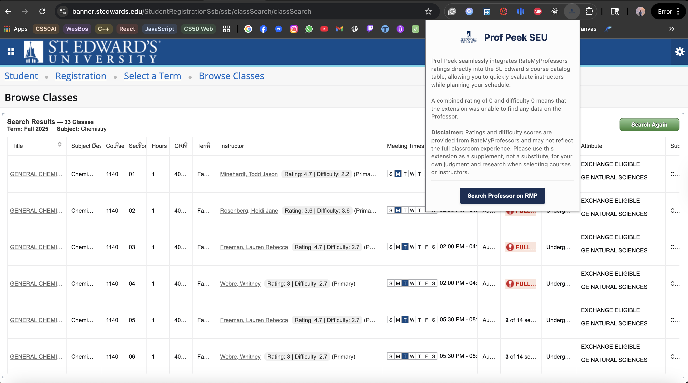

# Prof Peek SEU

Prof Peek is a Chrome Extension that automatically shows **RateMyProfessors (RMP) ratings and difficulty scores** next to instructor names in the **St. Edward’s University course registration system**.  
It helps students make more informed choices when registering for classes, without needing to manually search on RMP.

## Features
* Quickly view professor **ratings** and **difficulty** while browsing St. Edward’s course listings.
* Works seamlessly on St. Edward’s course banner.
* Caches results for 24 hours for faster performance.



## For Users
[Link to Chrome Web Store](https://chromewebstore.google.com/detail/gnkgbnaejgmdnkopodnfmcfodgbfahmd?utm_source=item-share-cb)
- Download the extension from the link above.

## For Developers / Contributors
1. **Clone the repository** or **Download the extension files** from this repository.
2. Install dependencies
```npm install```
3. Build the extension
```npm run build```
4. On Chrome, go to `chrome://extensions/` and enable **Developer Mode**.
5. Click **Load unpacked** and select the `dist/` folder from this project.

## Notes
- Works on [St. Edward's Course Banner](https://banner.stedwards.edu/StudentRegistrationSsb/ssb/classSearch/classSearch/) pages only.  
- Make sure you refresh the catalog page after installing the extension.  
- Data comes from Rate My Professor.
- GraphQL API is used to fetch data from RMP. [API Reference](https://github.com/DeveloperMindset123/rmp-ts-api/)
- Inspired by [ASUProfessorView](https://github.com/joshuamanigault/ASUProfessorView/)